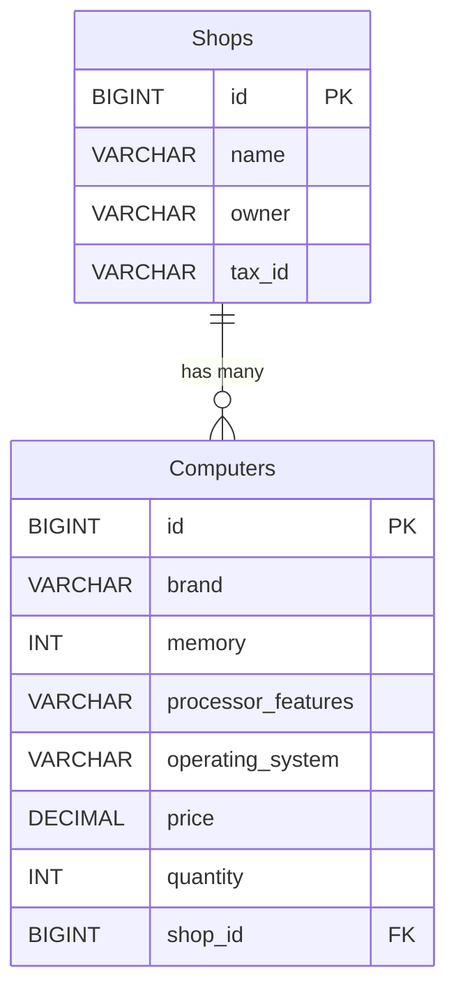
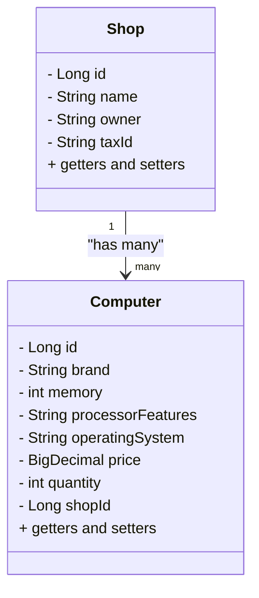

# Computers Shop
```
   _____                            _                   _____ _                 
  / ____|                          | |                 / ____| |                
 | |     ___  _ __ ___  _ __  _   _| |_ ___ _ __ ___  | (___ | |__   ___  _ __  
 | |    / _ \| '_ ` _ \| '_ \| | | | __/ _ \ '__/ __|  \___ \| '_ \ / _ \| '_ \ 
 | |___| (_) | | | | | | |_) | |_| | ||  __/ |  \__ \  ____) | | | | (_) | |_) |
  \_____\___/|_| |_| |_| .__/ \__,_|\__\___|_|  |___/ |_____/|_| |_|\___/| .__/ 
                       | |                                               | |    
                       |_|  

```
Se requiere desarrollar un programa que modele una tienda de computadores. La tienda posee los siguientes atributos:
Nombre de la tienda.
Propietario de la tienda.
Identificador tributario de la tienda.
Los computadores de la tienda tienen los siguientes atributos:
Marca del computador.
Cantidad de memoria.
Características del procesador.
Sistema operativo.
Precio del computador.
El programa debe poseer métodos que permitan:
Agregar un computador a la tienda.
Eliminar un computador de la tienda dada su marca.
Buscar un computador en la tienda dada su marca.
Listar la información de todos los computadores que tiene la tienda.
Requisitos:
Diagrama UML de clases
Tests unitarios obligatorios (cobertura mínima 70%)
Entregables:
Repositorio de Github
Captura de pantalla del diagrama de clase o enlace público al archivo de diagrams.net
Captura de pantalla de la sección testing de VSCode que muestre que se ha complido con la cobertura de tests

---

A program needs to be developed to model a computer store. The store has the following attributes:
Store name.
Shop owner.
Store tax ID.
The computers in the store have the following attributes:
Computer brand.
Amount of memory.
Processor features.
Operating system.
Computer price.
The program must have methods that allow:
Add a computer to the store.
Remove a computer from the store given its brand.
Search for a computer in the store given its brand.
List the information of all the computers that the store has.
Requirements:
UML class diagram
Mandatory unit tests (minimum coverage 70%)
Deliverables:
Github repository
Screenshot of class diagram or public link to diagrams.net file
Screenshot of VSCode's testing section showing that test coverage has been met

---


## Overview

The **Computers Shop** project is a Spring Boot application designed to manage a simple database of computer shops and their products. It includes features for creating, reading, updating, and deleting (CRUD) data related to shops and computers.

---

## Project Structure

```
src/
├── main/
│   ├── java/factoriaf5/computers_shop/
│   │   ├── Computer.java               # JPA entity for Computers
│   │   ├── ComputerController.java     # REST controller for Computers
│   │   ├── ComputerRepository.java     # Repository for Computer entity
│   │   ├── ComputerService.java        # Service layer for Computers
│   │   ├── ComputersShopApplication.java # Spring Boot Application entry point
│   │   ├── Shop.java                   # JPA entity for Shops
│   │   ├── ShopController.java         # REST controller for Shops
│   │   ├── ShopRepository.java         # Repository for Shop entity
│   │   ├── ShopService.java            # Service layer for Shops
│   ├── resources/
│   │   ├── application.properties      # Spring Boot configuration
│   │   ├── application-mysql.properties # MySQL profile configuration
│   │   ├── application-h2.properties   # H2 profile configuration
│   │   ├── schema.sql                  # Database schema definition
│   │   ├── data.sql                    # Database initialization data
│   │   ├── static/                     # Static web assets
│   │   └── templates/                  # Thymeleaf templates
├── Dockerfile                      # Docker image configuration
├── docker-compose.yml              # Multi-container configuration
├── pom.xml                         # Maven dependencies
```

---

## Features

1. **CRUD Operations**:
   - Manage shops and their computers via RESTful APIs.

2. **Database Support**:
   - MySQL and H2 database configurations are included.

3. **Preloaded Data**:
   - The application preloads data into the database from `schema.sql` and `data.sql`.

4. **Dockerized**:
   - Includes Docker Compose for setting up the application with MySQL and phpMyAdmin.

---

## Setup and Installation

### Prerequisites

- Java 21
- Maven 3.9+
- Docker and Docker Compose (v2.30.3 or higher)

### Steps

1. **Clone the Repository**:
   ```bash
   git clone https://github.com/olegukr/computers-shop.git
   cd computers-shop
   ```

2. **Build the Application**:
   ```bash
   mvn clean package
   ```

3. **Run with Docker**:
   ```bash
   docker compose up --build
   ```

4. **Access the Application**:
   - Application: [http://localhost:8089](http://localhost:8089)
   - phpMyAdmin: [http://localhost:8090](http://localhost:8090)

---

## Configuration Profiles

- **Default Profile**:
  - H2 Database.
  - `application-h2.properties`.

- **MySQL Profile**:
  - MySQL Database.
  - `application-mysql.properties`.
  - Set active profile in `application.properties`:
    ```properties
    spring.profiles.active=mysql
    ```

---

## Testing

Run the tests using Maven:
```bash
mvn test
```

Test reports can be found in the `target/surefire-reports` directory.

---

## Database Schema

- **Shops**:
  - `id`: BIGINT, Primary Key
  - `name`: VARCHAR(255)
  - `owner`: VARCHAR(255)
  - `tax_id`: VARCHAR(255)

- **Computers**:
  - `id`: BIGINT, Primary Key
  - `brand`: VARCHAR(255)
  - `memory`: INT
  - `processor_features`: VARCHAR(255)
  - `operating_system`: VARCHAR(255)
  - `price`: DECIMAL(10,2)
  - `quantity`: INT
  - `shop_id`: BIGINT, Foreign Key (References `shops` table)



---

## Troubleshooting

1. **MySQL Container Fails to Start**:
   - Ensure the `MYSQL_ROOT_PASSWORD` and `MYSQL_DATABASE` are correctly set in `docker-compose.yml`.

2. **Application Fails to Connect to MySQL**:
   - Verify the `spring.datasource.url` in `application-mysql.properties` matches the Docker network configuration.

3. **Preloaded Data Not Appearing**:
   - Ensure `schema.sql` and `data.sql` are correctly located in the `resources` folder.

---



## License

This project is licensed under the MIT License.